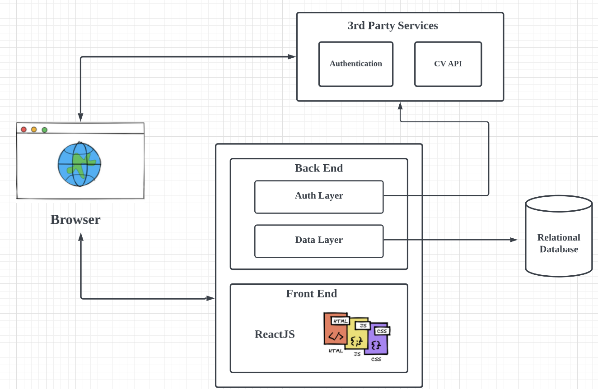
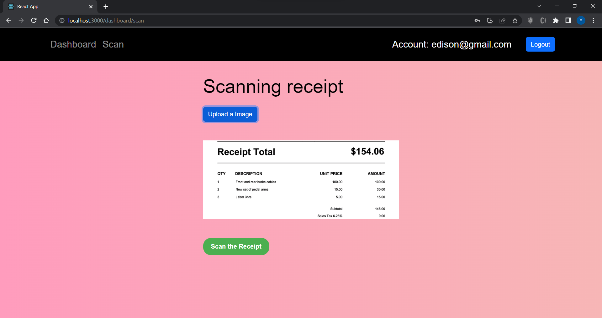
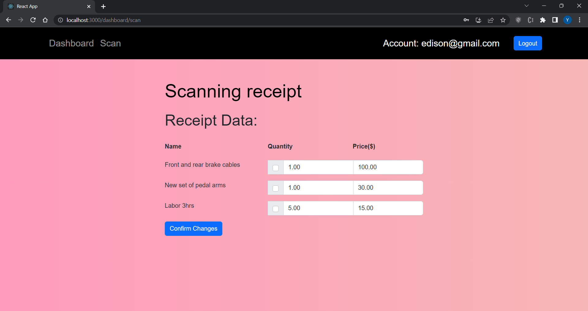
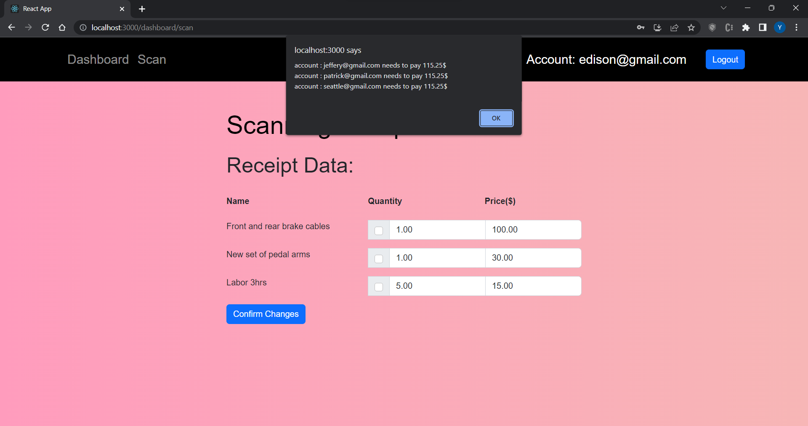

# Web Splitter Application

Using this application, you can have an online helper to help you split the bills with various requirements: even splitting and uneven splitting.

## Techincal Architecture
Overall, our application has a front end for displaying pages for clients to create group as well as scanning bill information, and a back end for storing data to save client information and bill information. In specific, for the front end, we created several pages for different usages, including logging in to accounts, scanning bills, viewing bills, creating groups, and joining groups. We use pytesseract API to scan the input image to get bill information in detail. To cooperate with the front end, the back end will save the account information(account id), bill information(total money & total people), and group information(money on each people & group name) by building the relational database. 




## Installation

Use the package manager [pip](https://pip.pypa.io/en/stable/) to install pytesseract to better run splitter on your device. In a shortcut, you can run "pip install -r ./backend/requirement.txt" to directly install all the packages.

```bash
requests==2.21.0
flask==2.1.3
oauthlib==3.0.1
pyOpenSSL==19.0.0
Flask-Login==0.4.1
pytesseract
Pillow
python-dotenv
flask-bcrypt
opencv-python
```

## Usage

The above image shows the scanning image page

The above image is the result after scanning by pytesseract CV API

The above image is the result of splitter on each person


## Contributing

Yiming Yin: Front-end developer
Ruozhen Yang: Front-end developer
Haoyu Zhai: Back-end developer
Xueqiang Xu: Back-end developer